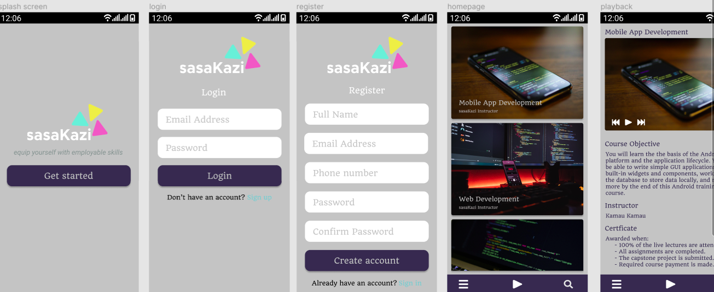

# sasaKazi

## Working prototype demo

## Tools
* **Firebase:** authentication | database | Real-time messaging | Storage.
* **ViewModel:** - *Stores UI-related data that isn't destroyed on app rotations*
* **LiveData:** *To build data objects that notify views when the underlying database changes.*
* Data Binding with binding adapters
* Navigation with the SafeArgs plugin
* **Multidex support.**

## Download apk
[Click here for download!](https://github.com/RocqJones/sasaKazi/blob/master/app/build/outputs/apk/debug/app-debug.apk)

## Libraries.
[Glide](https://github.com/bumptech/glide) - Glide is a fast and efficient open source media management and image loading framework for Android that wraps media decoding, memory and disk caching. 
[YouTube Player](https://github.com/PierfrancescoSoffritti/android-youtube-player) - YouTube Player library for Android and Chromecast, stable and customizable. - PierfrancescoSoffritti/android-youtube-player.

## Screenshots.
*Coming soon...*
