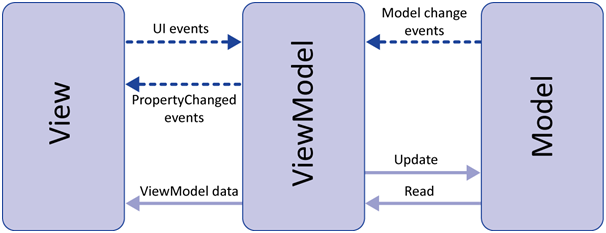
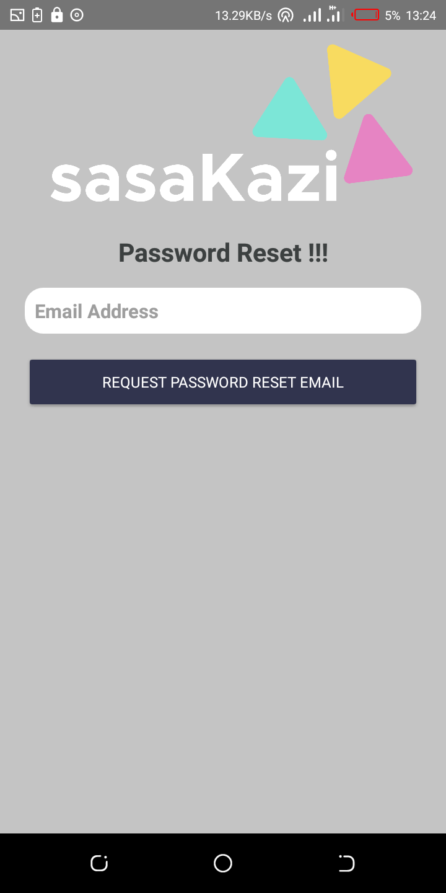
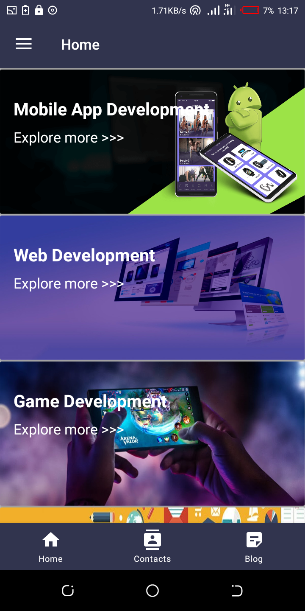
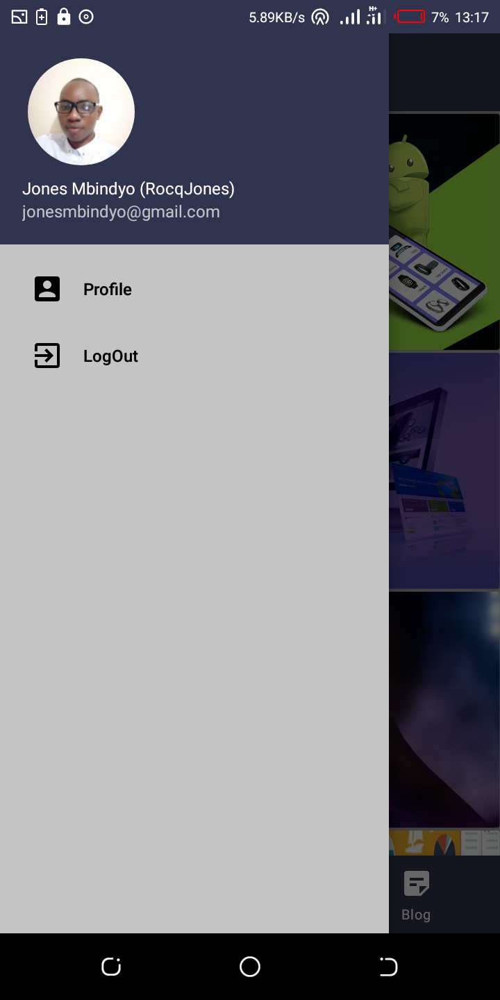
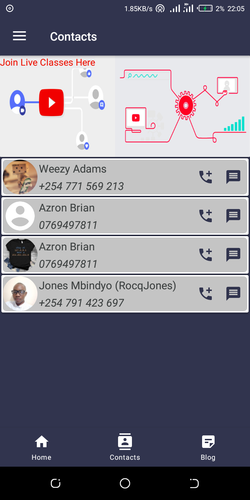

# sasaKazi

## Working prototype demo

## Structure.
**MVVM(Model view viewmodel architecture)** - Software architectural pattern that facilitates the separation of the development of the graphical user interface (the view) – be it via a markup language or GUI code.

## Features.
1. Real-Time Group Messaging (Discussion).
2. Blog Section.
3. Course Selection.
4. Classroom.

## Tools
* **Firebase:** authentication | database | Real-time messaging | Storage.
* **ViewModel:** *Stores UI-related data that isn't destroyed on app rotations*
* **LiveData:** *To build data objects that notify views when the underlying database changes.*
* Data Binding with binding adapters
* Navigation with the SafeArgs plugin
* **[Multidex support](https://developer.android.com/studio/build/multidex):** Below is Multidex Process illustration.
  - `Dex` stands for **Dalvik Executable**, which is what Google's virtual machine processor (Dalvik) uses to handle Android Applications. MultiDex integration in Android Studio allows Android Developers the ***ability to compile and execute a code-base with over 65,536 methods!***. 
  
* **[OkHttp interceptor](https://square.github.io/okhttp/interceptors/)** *It logs `HTTP` request and response data.* 
  

## Download apk
[Google Play](https://play.google.com/store/apps/details?id=com.intoverflown.sasakazi)

## Libraries.
[Glide](https://github.com/bumptech/glide) - Glide is a fast and efficient open source media management and image loading framework for Android that wraps media decoding, memory and disk caching. 
[YouTube Player](https://github.com/PierfrancescoSoffritti/android-youtube-player) - YouTube Player library for Android and Chromecast, stable and customizable. - PierfrancescoSoffritti/android-youtube-player. 
[Retrofit](https://square.github.io/retrofit/) - A `REST` Client for Java and Android. It makes it relatively easy to retrieve and upload `JSON` (or other structured data) via a *REST based webservice*. In Retrofit you configure which converter is used for the data serialization. 
[Kotlin Coroutines](https://kotlinlang.org/docs/coroutines-guide.html) - Coroutines are computer program components that *generalize subroutines for non-preemptive multitasking*, by allowing execution to be suspended and resumed. Coroutines are well-suited for implementing familiar program components such as *cooperative tasks, exceptions, event loops, iterators, infinite lists and pipes*. 

## Screenshots.

